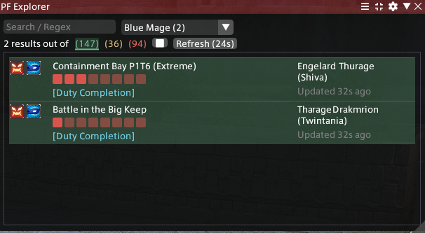
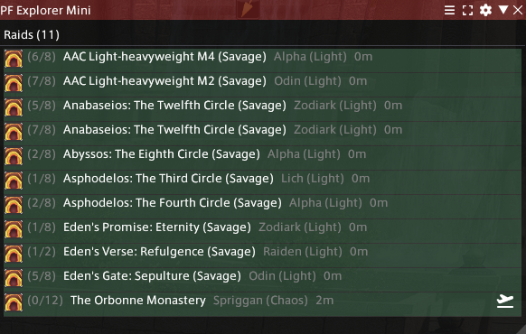

# PF Explorer

A Dalamud plugin that captures Party Finder listings as you browse them in-game and contributes them to [pfexplorer.com](https://pfexplorer.com), a cross-client Party Finder search site. In return, it can alert you (chat/toast/sound) when a listing matching your job/item level/data center filters appears, even while you're not looking at the in-game Party Finder window.

## Features

- **Cross-DC search** — see and filter Party Finder listings from every data center, not just the one you're currently on.
- **Click to open** — click a listing to jump straight to it in-game; Party Finder opens (or switches) to the right category automatically.
- **One-click travel** — for a listing on a data center you can actually reach, clicking it (or the dedicated travel icon) prompts a travel confirmation instead of just showing an error (via whatever `/li`-style travel command/plugin you have, e.g. Lifestream).
- **Notifications** — configurable alerts for new matches, party size changes, and listings closing, each with its own chat color, and clickable straight from the chat line.
- **Two view modes** — a full results window (icons, description, tags, freshness) or a compact minimal view for glancing at a corner of the screen.
- **Filters** — job, item level range, data center(s), category, and freshness (how recently a listing was reconfirmed).
- **Background scanning (opt-in)** — keeps contributing fresh data to pfexplorer.com even when you're not manually browsing Party Finder yourself.
- **Capture & contribute** — every PF listing you see in-game is uploaded to pfexplorer.com so other players can search it from the website or their own plugin.
- **Privacy-conscious by default** — private listings (friends/FC only) are never uploaded. Uploads are keyed to a random per-install ID, not your character name or account.

## Usage

- `/pfexplorer` or `/pf` — toggle the results window.
- `/pfconfig` — open plugin options (opens results too, if closed).

## How it works

`Plugin.cs` subscribes to Dalamud's `IPartyFinderGui.ReceiveListing` event, which fires for every listing the game receives while you have Party Finder open (or while the optional background scraper is cycling categories). Each listing is mapped to a plain DTO (`ListingMapper.cs`) and queued for a periodic, batched, HMAC-signed upload to the server (`ListingUploader.cs`). Separately, `AlertPoller.cs` polls the server's search endpoint on a timer and raises notifications for anything matching your configured filters.

## Data sent to the server

Per listing: the listing/recruiter's public Party Finder info (duty, world, job slots, description, etc. — the same data the game shows to any player who opens PF) and a locally-generated random contributor ID used only to count distinct installs. No account credentials, character name beyond what PF already shows, or fixed hardware/account identifiers are collected.

## AI usage

Developed with substantial AI assistance (Claude Code) under human direction and review — see [AI-DECLARATION.md](AI-DECLARATION.md) for the detailed breakdown.

## License

MIT — see [LICENSE](LICENSE).
